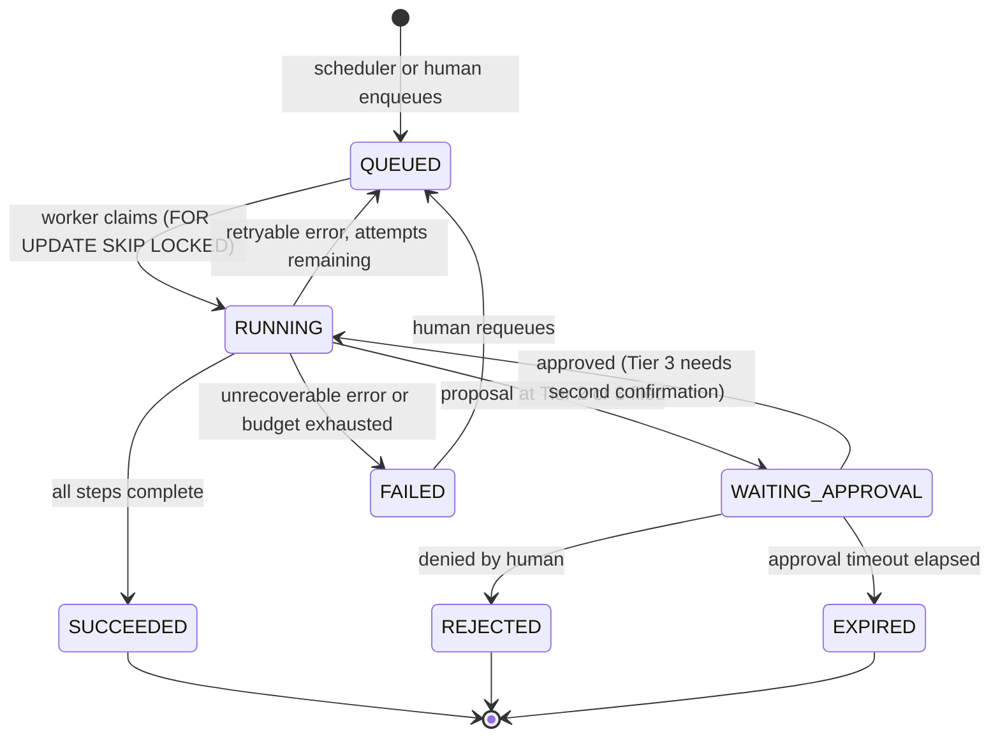

# Architecture

## Process model

Everything runs under Docker Compose on one Windows host (Docker Desktop +
WSL2), administered over Tailscale. Long-lived containers:

| Container | Role |
|---|---|
| `postgres` | The only datastore (pgvector available if ever needed; no Redis, no vector service). |
| `scheduler` | Tiny loop: reads schedules from config, inserts `tasks` rows at the appointed times. Owns no business logic. |
| `worker` | Claims tasks from the `tasks` table and runs them: the Replenishment Agent, ActionBroker executors, notification sending. One process, single-task concurrency in v1 (see below). |
| `browser` | Headless Chromium (Playwright) used only by broker executors for narescue.com. |
| `dashboard` | Read-only management UI, reachable only over Tailscale. Approvals do **not** require it — they work via email/SMS links served by `worker`'s small HTTP endpoint exposed publicly for signed approval tokens only. |

The `tasks` table is the queue. Postgres `SELECT ... FOR UPDATE SKIP LOCKED`
is the claim mechanism. No message broker — one host, low volume (a handful
of tasks per week), and a table is inspectable and auditable in a way a
broker is not.

## Task state machine

Transitions are written to `tasks` and `audit_log` **before** the work of
the new state begins (write-ahead), then updated with the outcome. Terminal
states: SUCCEEDED, REJECTED, EXPIRED, and FAILED (unless a human requeues).

## Delegation model

v1 has one agent, so "delegation" is deliberately minimal: the scheduler
delegates to the worker via task rows; the agent delegates side effects to
the ActionBroker via proposals; the human delegates judgment to nobody —
Tier 2+ waits for Zach. There is no agent-to-agent delegation. When more
agents exist, each will be a separate task `kind` claimed by the same
worker pool; delegation stays "insert a task row", never in-process calls
between agents, so every hand-off is durable and audited.

## Concurrency and conflict handling

- v1 worker runs **one task at a time**. Volume is a few tasks per week;
  serializing eliminates whole classes of races at zero practical cost.
- Claiming uses `FOR UPDATE SKIP LOCKED`, so even with multiple workers
  later, a task runs exactly once.
- A per-(entity, task-kind) **advisory lock** prevents two replenishment
  runs for the same entity overlapping (e.g. a manual run during the
  scheduled one). Second run fails fast with "already running".
- Proposals carry an idempotency key (docs/action-broker.md); duplicate
  execution is refused at the broker even if task logic misbehaves.
- Stale-data conflicts (approval arrives days after the numbers were
  computed): every proposal embeds the data snapshot timestamp; approvals
  older than `approval_ttl` *(param, default 7 days)* expire rather than
  execute on stale math.

## Failure model

Principle: **stop loudly, never guess quietly.** A missed report is
noticed; a wrong order might not be.

| Failure | Handling |
|---|---|
| **Agent process crash / host reboot** | Task rows stuck in RUNNING past their `heartbeat_at` + grace are reaped to QUEUED (retry) or FAILED (attempts exhausted) on worker start and periodically. Idempotency keys make re-runs safe: completed side effects are not repeated. |
| **External API 500 / timeout (Veeqo, Shopify)** | Retry with exponential backoff, `max_attempts` *(param, default 3)*. Still failing → task FAILED, Zach notified. Never proceed on partial or cached stock data. |
| **NAR session expiry mid-run** | Executor detects the login page, re-authenticates from env-var credentials, resumes the cart flow from its last completed, logged step. Login failure → proposal marked failed, task FAILED, notify. |
| **Model timeout / hang** | Every LLM call has a hard timeout; every task a wall-clock budget *(param)*. Exceeded → task killed and FAILED. |
| **Agent loop (model keeps calling tools)** | Per-task step budget and per-task token/cost budget *(params)*. Either exhausted → FAILED with the transcript preserved in `agent_runs` for inspection. |
| **Bad data (kit with no BOM, negative stock)** | Validation runs before any math; violations are hard failures with a named check on the report. |

Failures cost a week of convenience, never money: nothing purchases, and
every outbound effect sits behind an approval that shows its data snapshot.

## Why not a graph-based agent framework

Honest paragraph: frameworks like LangGraph would give us the state machine,
retries, and checkpointing above for free, and rejecting them costs us some
reimplementation. We reject them anyway for three reasons. First, the core
guarantees here — every side effect through one broker, write-ahead audit,
default-deny tiers — must be *verifiable by reading our code*; when the
control flow lives inside a framework's abstractions, proving "there is no
second path to the outside world" means auditing the framework, every
version bump. Second, the actual orchestration need is small: one agent, a
weekly task, a linear pipeline with one approval pause — a tasks table and
a state enum cover it in a few hundred lines that will not churn. Third,
this codebase must outlive framework fashion cycles; plain Python classes
over a thin `LLMClient` have no migration risk. If the org grows to many
agents with genuinely graph-shaped workflows, revisit — that decision is
recorded as reversible in ADR-0001.
